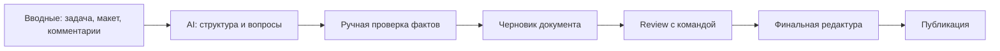

# AI Workflow Case

Этот кейс показывает, как я использую AI-инструменты в документации без передачи им ответственности за факты, терминологию и продуктовую логику.

## Принцип

AI помогает ускорять черновую работу, но финальное решение остается за автором.

Я использую AI для:

- структурирования неоформленных материалов;
- поиска нестыковок в сценариях;
- подготовки вариантов формулировок;
- сокращения длинных описаний;
- проверки единообразия терминов;
- подготовки вопросов к разработке, дизайну или QA.

Я не использую AI как источник истины. Факты проверяются по требованиям, макетам, задачам, API-контрактам и решениям команды.

## Workflow

## Пример задачи

Вводные:

- есть макет в Figma;
- в задаче описан основной сценарий;
- часть состояний интерфейса не описана;
- есть риск расхождения между текстом кнопки, ошибкой и backend-ограничением.

Что делает AI:

- предлагает список возможных состояний;
- помогает сгруппировать вопросы к команде;
- дает варианты коротких UX-текстов;
- подсвечивает неодинаковые термины.

Что проверяю вручную:

- соответствует ли текст реальной логике продукта;
- есть ли подтверждение в задаче или макете;
- не обещает ли текст действие, которого нет в интерфейсе;
- одинаково ли называются сущности в интерфейсе, документации и API.

## Результат

На выходе получается не просто текст, а набор проверяемых артефактов:

- список открытых вопросов;
- уточненный пользовательский сценарий;
- варианты UX-текстов;
- документационная заметка;
- checklist для QA или релиза.

## Почему это важно

В 2026 году AI становится частью работы технического писателя, но ценность специалиста остается в контроле качества:

- понять контекст;
- задать правильные вопросы;
- отделить факт от предположения;
- связать текст с продуктовой логикой;
- сделать результат поддерживаемым.
