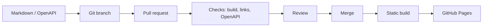

# Docs as Code Pipeline

Эта страница описывает пример пайплайна доставки документации: от Markdown-файла до опубликованного портала.

## Что решает пайплайн

Docs as Code нужен, когда документация должна обновляться вместе с продуктом:

- изменения проходят review;
- история правок хранится в Git;
- сборка проверяется автоматически;
- публикация не зависит от ручной выгрузки файлов;
- ошибки в ссылках, спецификациях и структуре ловятся до релиза.

## Архитектура пайплайна



## Минимальный набор проверок

| Проверка | Зачем нужна |
|---|---|
| Build | Документация собирается без ошибок |
| Link check | Нет битых внутренних ссылок |
| OpenAPI validation | API-контракт синтаксически корректен |
| Markdown lint | Единый стиль разметки |
| Spell / terms check | Меньше терминологических расхождений |

## Пример GitHub Actions

```yaml
name: docs

on:
  push:
    branches: [main]
  pull_request:

jobs:
  build:
    runs-on: ubuntu-latest
    steps:
      - uses: actions/checkout@v4
      - uses: peaceiris/actions-hugo@v3
        with:
          hugo-version: "0.150.0"
          extended: true
      - name: Build docs
        run: hugo --minify
```

## DocOps-ценность

Такой процесс помогает не просто "написать страницу", а управлять жизненным циклом документации:

- кто изменил документ;
- почему он изменился;
- прошла ли страница проверку;
- как связана документация с релизом;
- где искать источник истины.

## Что можно улучшать дальше

- добавить проверку OpenAPI через Spectral;
- добавить проверку ссылок;
- добавить preview для pull request;
- завести владельцев разделов;
- связать changelog продукта и changelog документации.
