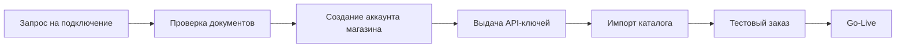
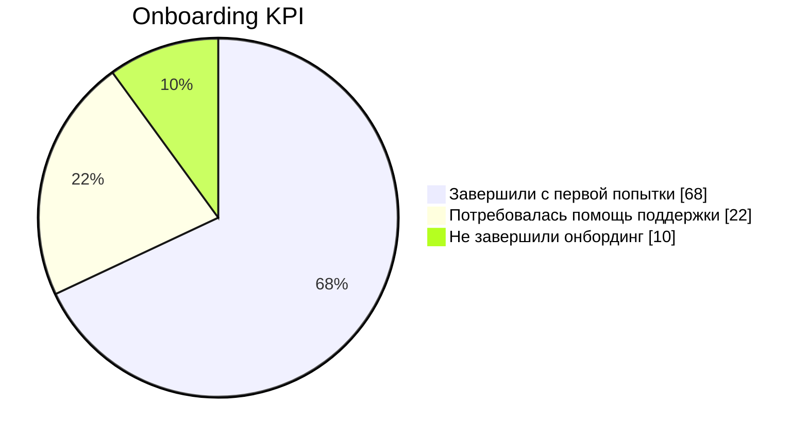

# Сценарий: Онбординг нового магазина

## Контекст

Новый партнерский магазин подключается к платформе, получает доступы и публикует первый каталог питомцев.

## BPMN (бизнес)

## API (технический контракт)

| Операция | Метод и путь | Назначение | Успех | Ошибки |
|---|---|---|---|---|
| Создать пользователя | `POST /user` | Регистрация администратора магазина | `201` | `400` |
| Добавить питомца | `POST /pet` | Публикация карточек | `200` | `400`, `422` |
| Загрузить изображение | `POST /pet/{petId}/uploadImage` | Контент карточки | `200` | `404` |

## Dev-задачи (что меняем в системе)

- Добавить шаблон онбординга с чеклистом выполнения шагов.
- Добавить endpoint для массовой загрузки карточек питомцев.
- Автоматизировать валидацию медиа и обязательных полей.
- Ввести onboarding status machine: `invited -> active -> verified`.

## User guide (действия оператора)

1. Создать учетную запись магазина и администратора.
2. Сгенерировать и передать API-ключ.
3. Загрузить минимум 10 карточек питомцев.
4. Проверить отображение карточек на витрине.
5. Выполнить тестовый заказ и подтвердить оплату.

!!! warning "Точка контроля"
    Не переводите магазин в `verified`, пока не выполнен тестовый заказ end-to-end.

## Дашборд (как измеряем эффект)

- Time-to-go-live (часы).
- Доля магазинов, завершивших онбординг с первой попытки.
- Ошибки импорта каталога на 100 карточек.

## Связанные разделы

- [Онбординг пользователя](/petstore-api-docs/users/onboarding/)
- [О проекте](/petstore-api-docs/about/)
