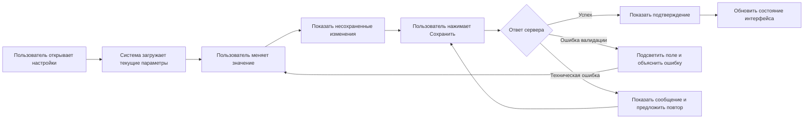

# Сценарий: Проверка интерфейсного состояния

## Контекст

Пользователь меняет важную настройку в личном кабинете. Команде нужно заранее описать, какие состояния интерфейса появляются до сохранения, после успешного сохранения и при ошибке, чтобы текст, дизайн, разработка и QA не разъехались.

## Карта сценария

## Что нужно зафиксировать в задаче

| Зона | Что описать | Зачем |
|---|---|---|
| Состояния | Загрузка, несохраненные изменения, успех, ошибка валидации, техническая ошибка | Чтобы UX-тексты и интерфейс не зависели от догадок |
| Ограничения | Какие поля обязательны, какие значения недопустимы, что делать при конфликте данных | Чтобы разработка и QA одинаково понимали бизнес-логику |
| Сообщения | Текст ошибки, подтверждение сохранения, подсказка для повторной попытки | Чтобы пользователь понимал, что произошло и что делать дальше |
| Проверки | Успешное сохранение, повтор после ошибки, уход со страницы с несохраненными изменениями | Чтобы не потерять edge cases перед релизом |

## Пример UX-текстов

| Состояние | Текст |
|---|---|
| Успешное сохранение | Изменения сохранены |
| Ошибка валидации | Проверьте значение в поле и попробуйте еще раз |
| Техническая ошибка | Не удалось сохранить изменения. Повторите попытку |
| Уход со страницы | Есть несохраненные изменения. Уйти без сохранения? |

## Вопросы к команде

- Нужно ли автосохранение или пользователь явно нажимает кнопку?
- Что происходит, если настройки меняются в другой вкладке?
- Нужно ли блокировать кнопку сохранения во время запроса?
- Кто видит системные ошибки: пользователь, поддержка, администратор?
- Где фиксируем событие для аналитики и логов?

## Проверки для QA

1. Изменить значение и убедиться, что появляется состояние несохраненных изменений.
2. Сохранить корректное значение и проверить подтверждение.
3. Ввести некорректное значение и проверить текст ошибки.
4. Смоделировать техническую ошибку и проверить возможность повторить действие.
5. Попробовать уйти со страницы до сохранения и проверить предупреждение.

## Связанные разделы

- [UX-тексты и troubleshooting](/portfolio/users/troubleshooting/)
- [Сценарий: Инцидент - сбой оплаты](/portfolio/scenario-payment-incident/)
