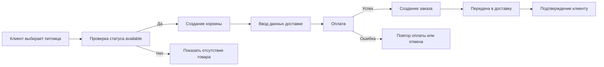
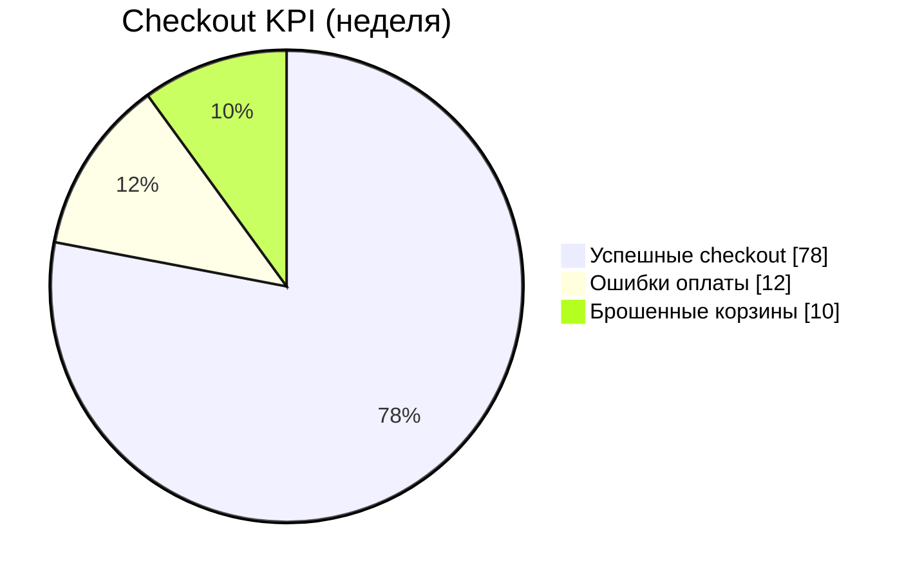

# Сценарий: Оформление заказа

## Контекст

Клиент оформляет заказ на питомца через витрину. Система должна корректно провести проверку наличия, оплату, создание заказа и передачу в доставку.

## BPMN (бизнес)



## API (технический контракт)

| Операция | Метод и путь | Назначение | Успех | Ошибки |
|---|---|---|---|---|
| Получить питомца | `GET /pet/{petId}` | Проверка данных карточки | `200` | `404` |
| Создать заказ | `POST /store/order` | Фиксация покупки | `201` | `400`, `422` |
| Получить заказ | `GET /store/order/{orderId}` | Проверка статуса | `200` | `404` |

Пример создания заказа:

```bash
curl -X POST "https://petstore.swagger.io/v2/store/order" \
  -H "Content-Type: application/json" \
  -d '{"id":1001,"petId":1,"quantity":1,"status":"placed","complete":false}'
```

## Dev-задачи (что меняем в системе)

- Добавить валидацию `petId` перед записью заказа.
- Добавить идемпотентность `POST /store/order` по `X-Request-ID`.
- Логировать этапы `payment_authorized`, `order_created`, `delivery_queued`.
- Покрыть контрактными тестами ответы `201/400/422`.

## User guide (действия оператора)

1. Проверить, что питомец имеет статус `available`.
2. Создать заказ и подтвердить данные клиента.
3. Убедиться, что платеж прошел успешно.
4. Передать заказ в обработку доставки.
5. Сообщить клиенту номер заказа.

!!! warning "Контрольный шаг"
    Не переводите заказ в доставку до подтверждения успешной оплаты.

## Дашборд (как измеряем эффект)

- Conversion rate checkout.
- Доля ошибочных оплат.
- Среднее время от создания до передачи в доставку.



## Связанные разделы

- [Справочник API](api.md)
- [Interactive API](interactive-api.md)
- [Устранение неполадок](users/troubleshooting.md)
