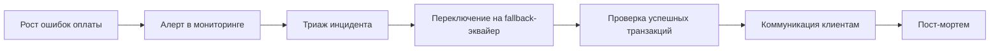
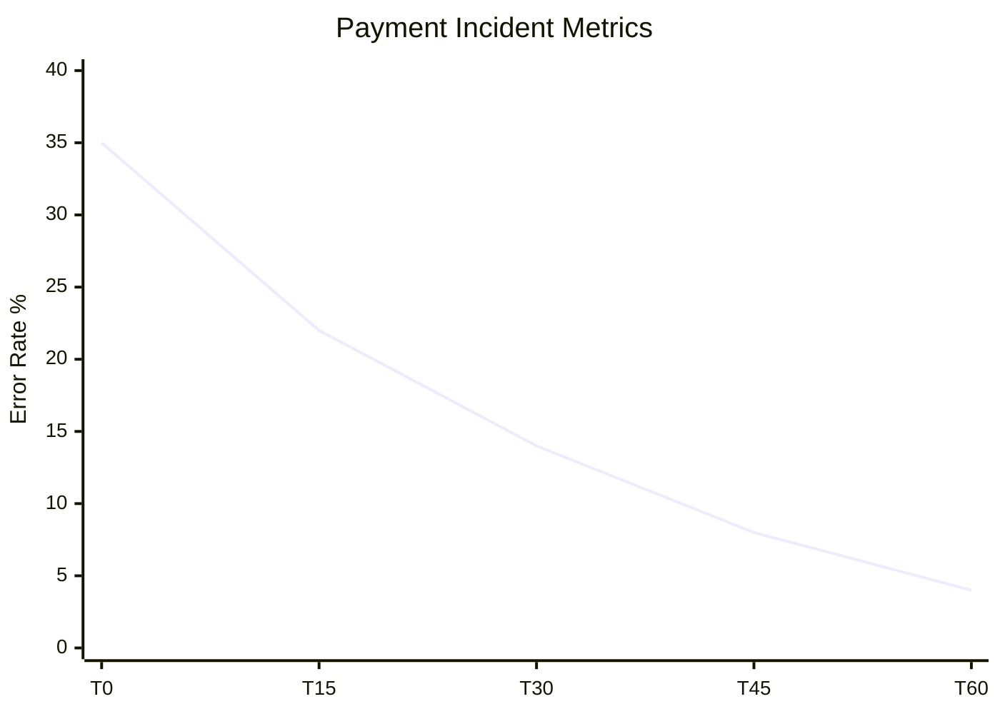

# Сценарий: Инцидент — сбой оплаты

## Контекст

Во время checkout платежный шлюз возвращает ошибки. Нужно минимизировать потери заказов и быстро восстановить стабильность.

## BPMN (бизнес)

## API (технический контракт)

| Операция | Метод и путь | Назначение | Успех | Ошибки |
|---|---|---|---|---|
| Создать заказ | `POST /store/order` | Основная операция checkout | `201` | `400`, `402`, `503` |
| Получить заказ | `GET /store/order/{orderId}` | Проверить финальный статус | `200` | `404` |

Требования к ошибке оплаты:

- Код ошибки должен быть машинно-читабельным (`PAYMENT_GATEWAY_TIMEOUT`, `PAYMENT_DECLINED`).
- Ответ должен включать `traceId` для поиска в логах.

## Dev-задачи (что меняем в системе)

- Ввести retry policy для временных ошибок эквайера.
- Добавить circuit breaker на интеграцию платежного шлюза.
- Реализовать feature-flag для переключения провайдера оплаты.
- Расширить логирование и метрики по коду причины отказа.

## User guide (действия оператора)

1. Проверить дашборд ошибок оплаты и подтверждение инцидента.
2. Включить fallback-канал оплаты по инструкции дежурного.
3. Повторно обработать зависшие заказы.
4. Уведомить клиентов о восстановлении сервиса.
5. Зафиксировать инцидент в журнале и передать в пост-мортем.

!!! warning "SLA"
    Время реакции на массовый сбой оплаты — до 15 минут.

## Дашборд (как измеряем эффект)

- Payment error rate.
- Mean time to mitigation (MTTM).
- Процент восстановленных заказов после инцидента.

## Связанные разделы

- [Устранение неполадок](users/troubleshooting.md)
- [Changelog](changelog/index.md)
